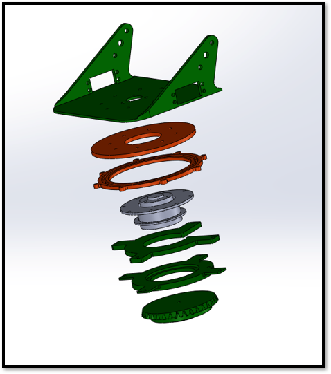

# Pneumatic Tank with Reloading Mechanism

A pneumatic projectile launcher designed with a custom automated reloading mechanism. This project is based on a course named mechanical practice.

This project won the 1st place in [Mechanical Practice and Capstone Project Competition](https://me.nycu.edu.tw/zh_tw/news8/announcements/%E6%A9%9F%E6%A2%B0%E7%B3%BB%E6%96%BC113%E5%B9%B41%E6%9C%883%E6%97%A5%E8%88%89%E8%BE%A6-2023%E6%A9%9F%E6%A2%B0%E5%AF%A6%E4%BD%9C%E6%88%90%E6%9E%9C%E7%99%BC%E8%A1%A8%E7%AB%B6%E8%B3%BD-%E7%B6%93%E9%A9%97%E5%82%B3%E6%89%BF%E8%88%87%E5%88%86%E4%BA%AB-29685827).


## Overview

- Pneumatic projectile launching system using compressed air for firing
- Rotary magazine mechanism for automated reloading
- Monocular camera-based range estimation with YOLOv8 object detection to enable autonomous target acquisition and aiming

## Demo


[Watch the video](https://youtu.be/MhBOqN-i4nw)

## Technical Highlights

- **Control System**:
  - Arduino for basic control logic
  - Raspberry Pi Compute Module for high-level control logic and capturing image
  - Steam deck for image recognition system and user interface
- **Launching**: Compressed CO2
- **Reload Mechanism**: Rotating magazine with a nozzle that push the next round into the chamber
- **Design Tools**: Solidworks 2019, 3D printing for custom parts

## Design & Documentation

```
├───cad # 3D cad
├───doc # Documents
├── pic # Pictures
└── src # Source code
```

## Gallery

<table>
  <tr>
    <td></td>
    <td></td>
  </tr>
  <tr>
    <td></td>
    <td></td>
  </tr>
  <tr>
    <td></td>
    <td></td>
  </tr>
</table>

## Authors

| Competition Member                  | Responsibilities                                    | Allocation (%) |
|--------------------------------------|-----------------------------------------------------|----------------|
| **Wu Dian-Mou, Dept. of Mechanical Eng.**   | **PPT creation, all programming**                   | **36**             |
| Chen O Wen, Dept. of Mechanical Eng. | Mid-term presentation, reloading mechanism, firing mechanism | 25             |
| Hsieh O En, Dept. of Mechanical Eng.| Final presentation, steering, integration           | 25             |
| Wang O Yi, Dept. of Mechanical Eng.  | Base platform                                        | 10             |
| Chang O Yuan, Dept. of Mechanical Eng.| Reloading                                           | 4              |

> Some members' names not fully displayed due to privacy reasons.
